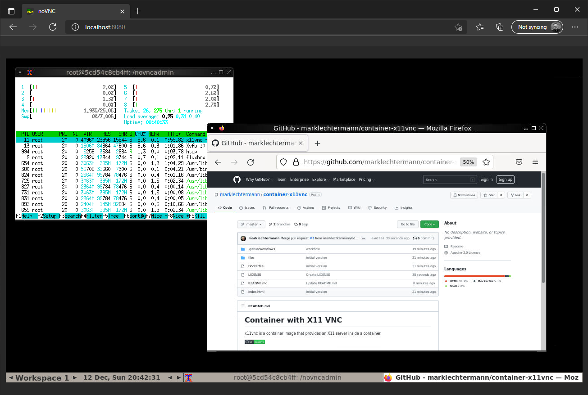

# Container with X11 VNC

x11vnc is a container image that provides an X11 server inside a container.

[](https://github.com/marklechtermann/container-x11vnc/actions/workflows/ci.yaml)



# Run 
```bash
docker run -it -p 8080:8080 -e DISPLAY_WIDTH=1280 -e DISPLAY_HEIGHT=720 marklechtermann/x11vnc
```

# Build 

```bash
docker build -t marklechtermann/x11vnc .
```
